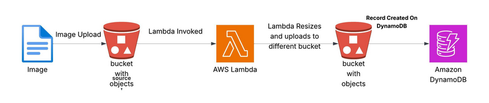

# 🖼️ Serverless Image Processing with S3, Lambda, and DynamoDB

This project demonstrates a serverless architecture using AWS Lambda to process images uploaded to an S3 bucket. Upon upload, the image is resized, stored in a separate destination S3 bucket, and a log record is added to a DynamoDB table.

---

## 📊 Architecture Diagram



---

## 🛠️ Components

- **S3 Source Bucket**: Where original images are uploaded.
- **Lambda Function**: Triggered by S3 event, resizes the image, uploads to destination, and logs to DynamoDB.
- **S3 Destination Bucket**: Stores resized images.
- **DynamoDB Table**: Logs metadata for each processed image.

---

## ✅ Prerequisites

- AWS Account
- IAM Role with permissions for:
  - `s3:GetObject`, `s3:PutObject`
  - `dynamodb:PutItem`
  - `logs:*` (optional for debugging with CloudWatch)

---

## 📂 Setup Instructions (Manual)

### 1. Create Two S3 Buckets
- Source Bucket: Example: `source-bucket-yourname`
- Destination Bucket: Example: `dest-bucket-yourname`

### 2. Create DynamoDB Table
- Table Name: `ImageProcessingLog`
- Partition Key: `ImageKey` (String)

### 3. Create Lambda Function
- Runtime: Python 3.11
- Trigger: S3 `ObjectCreated` event from the source bucket
- Attach an IAM role with access to S3 and DynamoDB

### Use this code:

```python
import boto3
import os
from PIL import Image
import io
from datetime import datetime

s3 = boto3.client('s3')
dynamodb = boto3.resource('dynamodb')
DEST_BUCKET = os.environ['DEST_BUCKET']
DDB_TABLE = os.environ['DDB_TABLE']

def lambda_handler(event, context):
    table = dynamodb.Table(DDB_TABLE)

    for record in event['Records']:
        bucket = record['s3']['bucket']['name']
        key = record['s3']['object']['key']

        response = s3.get_object(Bucket=bucket, Key=key)
        image = Image.open(response['Body'])
        image = image.resize((800, 800))

        buffer = io.BytesIO()
        image.save(buffer, 'JPEG')
        buffer.seek(0)

        s3.upload_fileobj(buffer, DEST_BUCKET, f"processed-{key}")

        table.put_item(
            Item={
                'ImageKey': key,
                'SourceBucket': bucket,
                'DestinationBucket': DEST_BUCKET,
                'ProcessedAt': datetime.utcnow().isoformat(),
                'ImageSize': f"{image.width}x{image.height}",
                'ImageFormat': 'JPEG'
            }
        )

    return {'statusCode': 200, 'body': 'Image processed and logged successfully.'}
```

---

## 🧪 Test the System

1. Upload a supported image to your source S3 bucket.
2. Confirm it appears in the destination bucket (resized).
3. Check DynamoDB table for a new log record.

---

## 📌 Notes

- ✅ Supports common image formats handled by Pillow (JPG, PNG, etc.)
- ✅ Lambda timeout/memory should be adjusted for larger images
- ✅ You can adjust the `resize()` dimensions in the code
